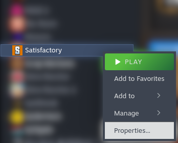
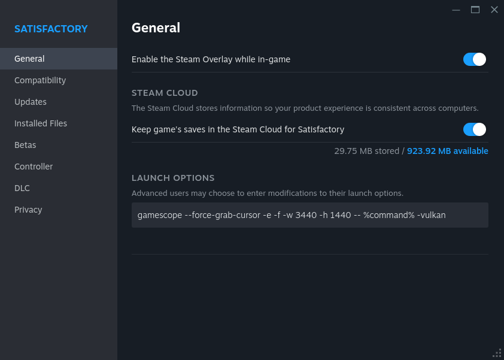
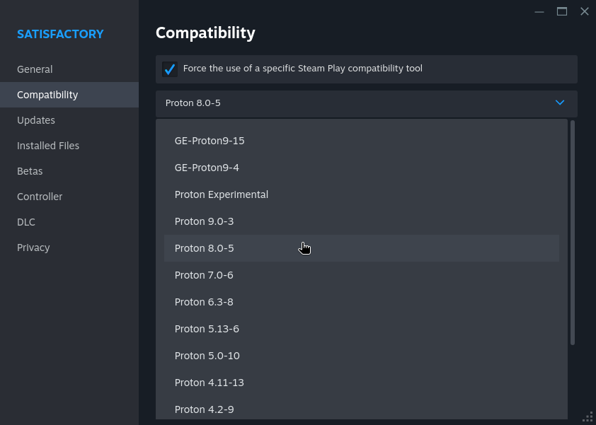

+++
title = "Running Satisfactory on Linux"
description = "A short guide to running Satisfactory on Linux."
date = "2024-10-06T00:00:00Z"
+++
If you already know how to install packages and set launch options for games on Steam you can use "The Short Version", if you don't, read "The Long Version" for an explanation.

- Install "gamescope" from your distro's package manager
- Set the launch options for Satisfactory to `gamescope --force-grab-cursor -e -f -w 1920 -h 1080 -- %command% -vulkan`, replacing "1920" and "1080" with the width and height of your display
- Launch the game as normal


  First, you will need to install "gamescope" from your distro's package manager.

Examples:

Debian based distros (Ubuntu, Linux Mint, etc.):
```bash
apt install gamescope
```

Fedora or RHEL:
```bash
dnf install gamescope
```

Arch based distros (EndeavourOS, Manjaro Linux, etc.):
```bash
pacman -S gamescope
```

---

Once you have done that, you need to set the launch options for Satisfactory.

- First, open the properties for Satisfactory



- Now, paste `gamescope --force-grab-cursor -e -f -w 1920 -h 1080 -- %command% -vulkan` in the Launch Options box, replacing "1920" and "1080" with the width and height of your display.



- Lastly, go to the Compatibility tab and set the version of Proton to 8.0-5.



---

You should now be able to launch and play the game as normal.
